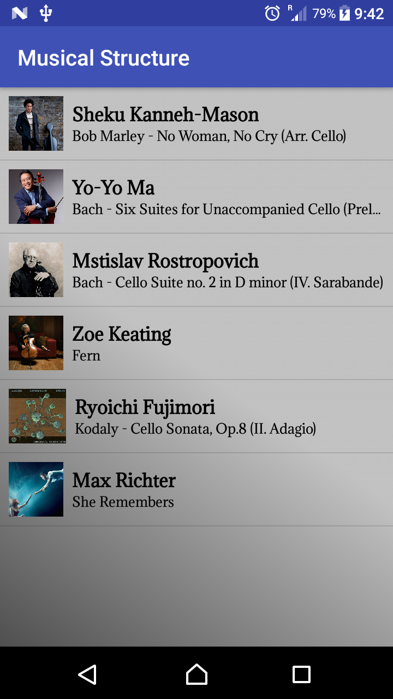

# Musical Structure

This is an Android app that displays several prominent cello pieces in a master / detail UI design, created as part of the [Android Basics Nanodegree by Google](https://www.udacity.com/course/android-basics-nanodegree-by-google--nd803).

### Skills Demonstrated

- Correct use of static member variables.
- Access level modifiers on custom classes.
- Passing custom objects and their defining their accessor methods.
- Implicit and explicit intents.

#### Introduction grid on 720 x 1280p (API 25) in portrait orientation.
#### 

#### Item details on 720 x 1280p (API 25) in portrait orientation.
#### 
